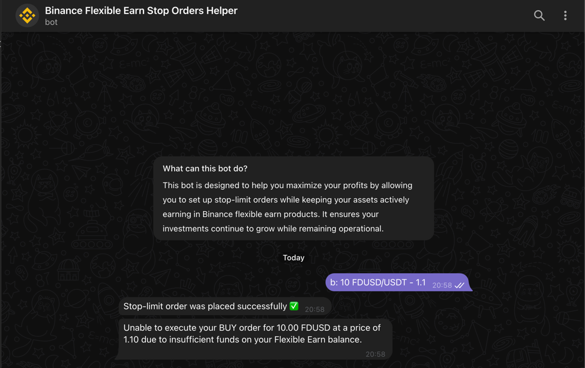

# binance-flexible-earn-stop-orders-helper-bot

<h2>Overview</h2>

A bot designed to help users maximize their profits by allowing them to set up stop-limit orders while keeping their assets actively earning in Binance flexible earn products.
This ensures that your assets continue to earn interest, even as the bot monitors market conditions and places your stop-limit orders when specified price levels are reached.

<h2>Key features</h2>

<ul>
    <li>Seamless Binance API Integration: Securely connect your Binance account using your API key and secret to enable real-time order management.</li>
    <li>Active Order Management: Effortlessly list, create, and cancel stop-limit orders directly through the bot, ensuring your trading strategy is always on-track.</li>
    <li>Flexible Earn Integration: Keep your assets in Binance Flexible Earn while still setting price thresholds for your stop-limit orders, ensuring continuous growth of your funds.</li>
    <li>Comprehensive Account Control: Easily disconnect your Binance account at any time, maintaining full control over your data and usage.</li>
    <li>In-Depth Help and Guidance: A built-in help menu provides detailed instructions to navigate all bot features with ease.</li>
</ul>

<h2>Bot Interaction</h2>

<h3>Commands overview</h3>

<ul>
    <li>
        <b>/start</b>: Begin by connecting your Binance account using API key and secret.
    </li>
    <li>
        <b>/menu</b>: Access the main menu for managing orders and account settings.
    </li>
    <li>
        <b>/help</b>: View instructions and FAQs to assist with using the bot effectively.
    </li>
</ul>

<h3>User Interface Overview</h3>

<ol>
    <li>Main menu:</li>
    <ul>
        <li>Overview of all available options, including managing orders, accessing help, and supporting the developer.</li>
    </ul>
    <li>Order management:</li>
    <ul>
        <li>View active orders: display all active stop-limit orders in one place.</li>
        <li>Create a new order: set up new stop-limit orders with customizable parameters.</li>
        <li>Cancelling an order: cancel your orders at any time with a single button.</li>
    </ul>
    <li>Account management:</li>
    <ul>
        <li>Safely disconnect your Binance account and cancel any pending orders when needed.</li>
    </ul>
</ol>

<h2>Usage</h2>

If you want to leverage this bot for personal or commercial use, perform the following steps:

<ol>
    <li>
        <b>Register your bot on Telegram</b>
        <ul>
            <li>Follow the <a href="https://core.telegram.org/bots/api">official Telegram Bot API documentation</a> to register your bot and obtain a bot token.</li>
        </ul>
    </li>
    <li>
        <b>Configure the bot</b>
        <ul>
            <li>Save generated bot's token and username in the application.properties file.</li>
            <li>Update your database connection settings in application.properties.</li>
        </ul>
    </li>
    <li>
        <b>Run the bot</b>
        <ul>
            <li>You can run the bot locally or deploy it to your preferred environment. Ensure the environment has a <b>static</b> IP address.</li>
        </ul>
    </li>
    <li>
        <b>Allowlist the bot's IP address</b>
        <ul>
            <li>On Binance, whitelist the bot's IP address for your API key to enable secure and uninterrupted trading.</li>
        </ul>
    </li>
</ol>

<h2>Screenshots</h2>

Here are visual guides to help you navigate the bot's features:

Before start:

Start command:

Account connection:

If account already connected:

Main menu:

Order menu:

Order creation:

Order list:

Order cancellation:

Order execution failure:

Order execution success:

Support:

Help command:

Account disconnection:

<h2>Licence</h2>

This project is licensed under the [MIT License](LICENSE.MD).